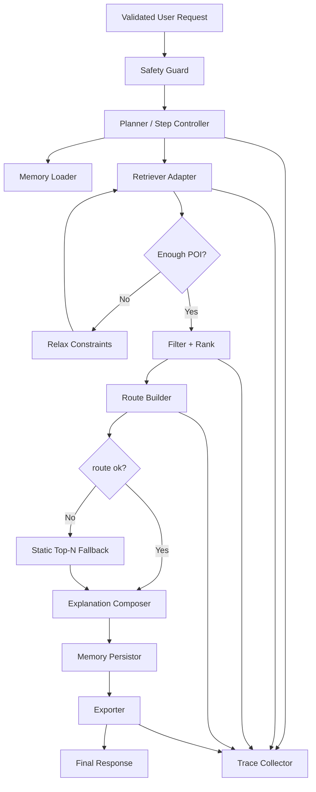

# C4 Component — Orchestrator Core

Роль компонентов:
- `Planner` управляет переходами и stop conditions;
- `Trace Collector` фиксирует шаги для eval/debug;
- `Relax Constraints` и `Static Top-N` реализуют graceful degradation.
