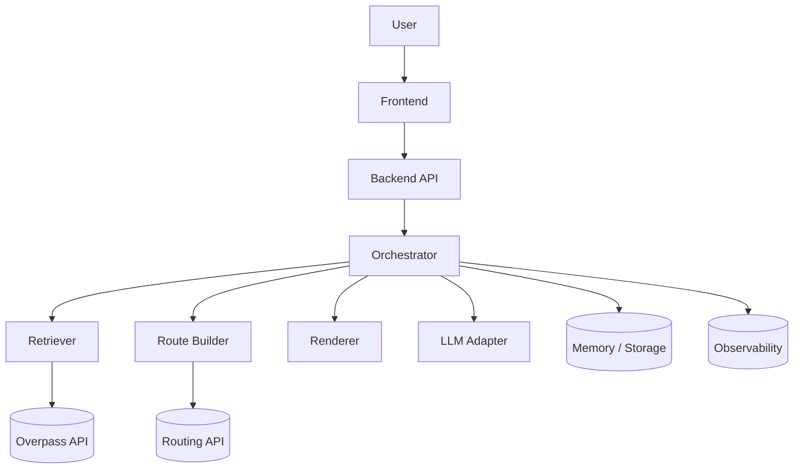

# C4 — Container

```mermaid
flowchart TB
    User --> UI[Frontend]

    UI --> API[Backend API]

    API --> ORCH[Orchestrator]
    ORCH --> RET[Retriever]
    ORCH --> ROUTER[Route Builder]
    ORCH --> RENDER[Renderer]
    ORCH --> LLM[LLM Adapter]

    RET --> OSM[(Overpass API)]
    ROUTER --> Routing[(Routing API)]

    ORCH --> DB[(Memory / Storage)]
    ORCH --> LOGS[(Observability)]
```

Контейнеры:

Orchestrator — управление логикой
Retriever — поиск POI
Router — построение маршрута
Renderer — финальный ответ