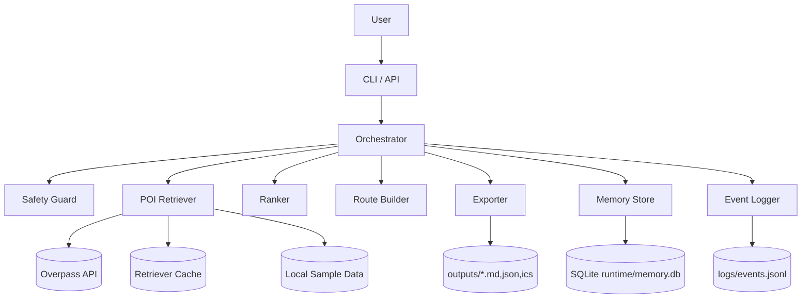

# C4 Container

Контейнерные решения:
- Orchestrator как точка координации;
- Retriever имеет multi-source режим (live/cache/sample);
- Observability и Memory вынесены в отдельные контейнеры для стабильности и тестируемости.
