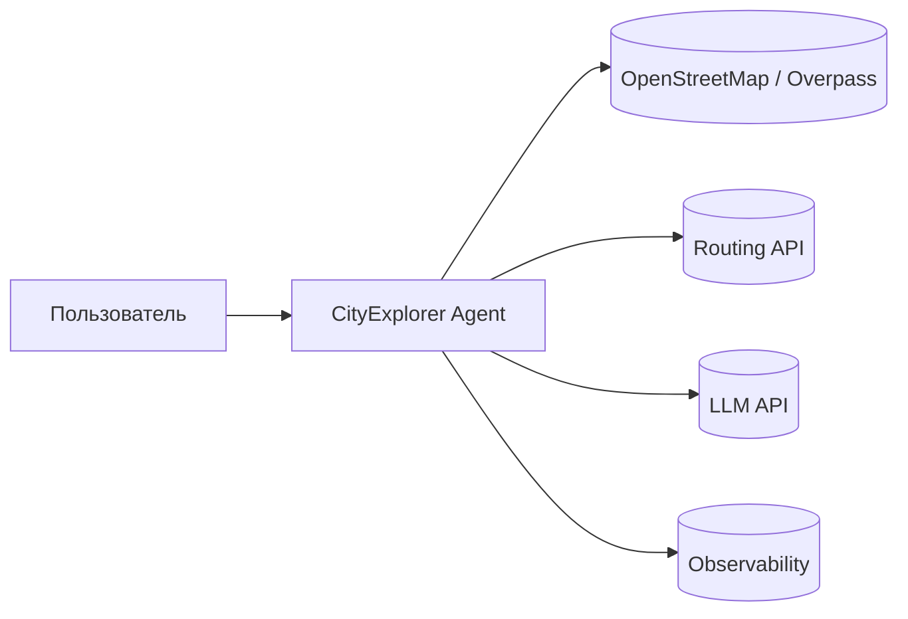

# C4 — Context

```mermaid
flowchart LR
    User[Пользователь]
    System[CityExplorer Agent]

    OSM[(OpenStreetMap / Overpass)]
    Routing[(Routing API)]
    LLM[(LLM API)]
    Logs[(Observability)]

    User --> System
    System --> OSM
    System --> Routing
    System --> LLM
    System --> Logs
```

Граница: пользователь взаимодействует только с агентом, все API скрыты.