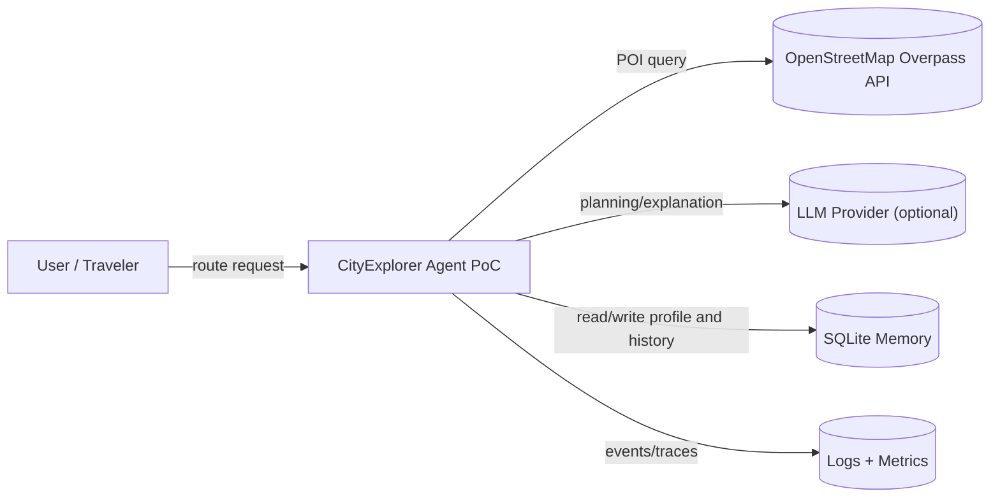

# C4 Context

Границы:
- пользователь взаимодействует только с CityExplorer;
- внешние API рассматриваются как недоверенные источники;
- side effects ограничены локальным экспортом и локальным storage.
