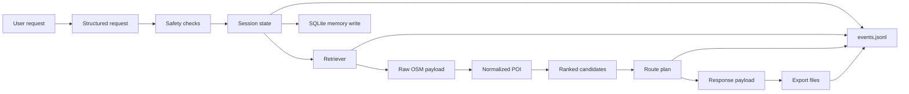

# Data Flow Diagram

## Что хранится

| Тип данных | Хранилище | TTL/Retention | Комментарий |
|---|---|---|---|
| User preferences (категории/город/бюджет) | SQLite `user_profiles` | до ручной очистки | без PII |
| Route history (сводка остановок) | SQLite `route_history` | до ручной очистки | для personalization/evals |
| Tool/trace logs | `logs/events.jsonl` | 14 дней | latency, status, errors |
| Retriever cache | `runtime/poi_cache.json` | 30 минут | ускорение + деградация |

## Что не хранится

- точная live-геолокация пользователя;
- платежные данные;
- контактные или иные чувствительные персональные данные.
