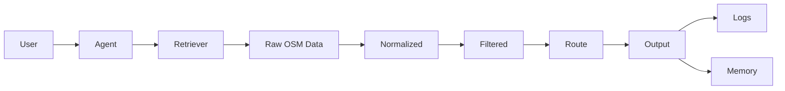

# Data Flow

Что хранится
| Данные      | Где           |
| ----------- | ------------- |
| POI         | временно      |
| preferences | memory        |
| logs        | observability |

Что НЕ хранится
* точная геолокация
* PII
