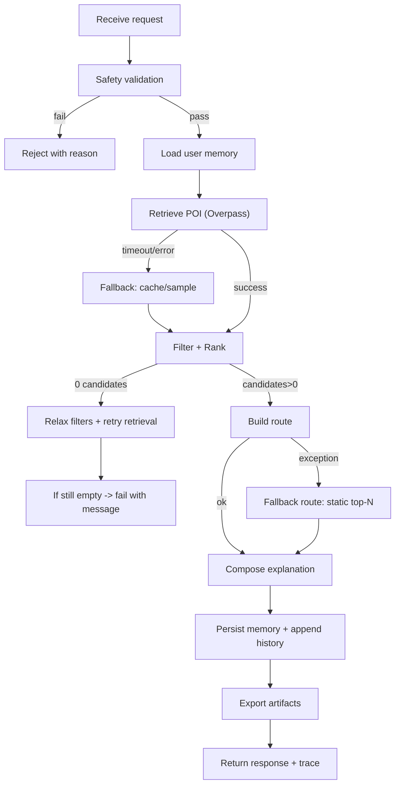

# Workflow / Execution Graph

Гарантия PoC:
- система стремится вернуть полезный результат даже при деградации внешних зависимостей;
- hard fail происходит только при нарушении safety или полном отсутствии данных после fallback.
